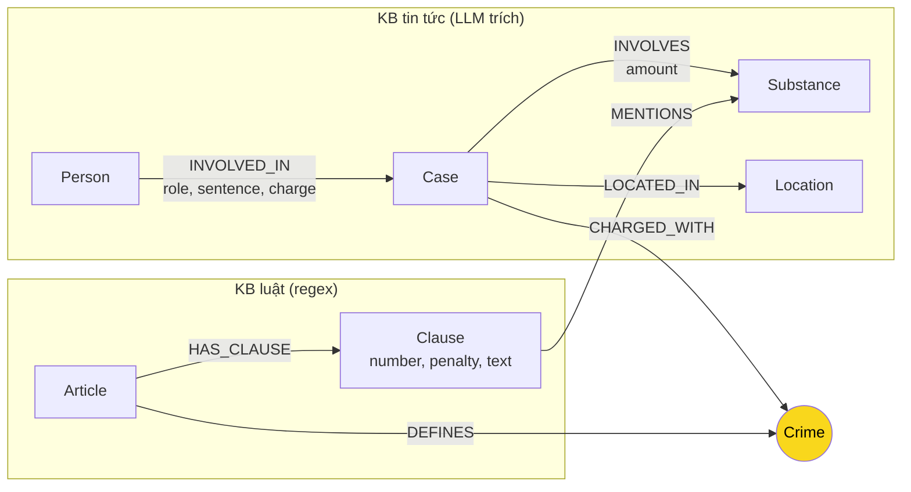

# Thiết kế Ontology — Day 19

**Họ tên:** Phan Duy Bao  **MSSV:** 2A202602767

**Lựa chọn** (đánh dấu một):
- [x] Dùng ontology gợi ý (có thể chỉnh nhỏ)
- [ ] Tự thiết kế (xét bonus +15, xem `SUBMISSION.md`)

> Hướng dẫn: `LAB_GUIDE.md` Bước 2. Mục 7 không áp dụng vì không xét bonus.

## 1. Sơ đồ

`Crime` (màu vàng) là **node cầu nối** giữa KB luật và KB tin tức.

`Substance` là node dùng chung của cả hai KB: luật `MENTIONS` nó trong khoản, vụ án `INVOLVES` nó. Nó là cầu nối thứ hai, yếu hơn `Crime` (xem mục 4).

## 2. Entity types (node labels)

| Label | Ý nghĩa | Khóa định danh (`MERGE` theo) | Properties | Lấy từ KB nào | Trích bằng |
| --- | --- | --- | --- | --- | --- |
| `Article` | Một Điều luật | `id` ("Điều 251 BLHS", "Điều 2 Luật PCMT") | `title`, `law`, `doc_id` | luật | regex (`parse_law_article`) |
| `Clause` | Một khoản của Điều | `id` ("Điều 251 BLHS khoản 1") | `number`, `penalty`, `text`, `doc_id` | luật | regex |
| `Crime` | Tội danh chuẩn hóa (bỏ tiền tố "Tội", chữ thường) | `name` | không có `doc_id` (dùng chung) | luật (tạo), tin (nối vào) | regex từ tiêu đề Điều; phía tin: LLM + `link_entity` |
| `Substance` | Chất ma túy | `name` | không có `doc_id` (dùng chung) | cả hai | luật: `find_substances` (regex danh sách chuẩn); tin: LLM |
| `Case` | Một vụ việc/vụ án trong bài báo | `name` (do LLM đặt) | `summary`, `date`, `doc_id`, `source_title` | tin | LLM |
| `Person` | Bị cáo/nghi phạm/người liên quan | `name` | `aliases` | tin | LLM |
| `Location` | Tỉnh/thành phố | `name` | — | tin | LLM |

## 3. Relationships

| Type | Từ → Đến | Properties trên cạnh | Ý nghĩa |
| --- | --- | --- | --- |
| `DEFINES` | Article → Crime | — | Điều luật định nghĩa tội danh (chỉ Điều có tiêu đề "Tội …") |
| `HAS_CLAUSE` | Article → Clause | — | Điều gồm các khoản |
| `MENTIONS` | Clause → Substance | — | Khoản nêu tên chất (để lọc khoản theo khối lượng/loại chất) |
| `CHARGED_WITH` | Case → Crime | — | Vụ án bị truy tố/xét xử về tội này. **Đây là cạnh bắc cầu.** |
| `INVOLVES` | Case → Substance | `amount` | Vụ án liên quan chất nào, khối lượng bao nhiêu |
| `LOCATED_IN` | Case → Location | — | Nơi xảy ra/xét xử |
| `INVOLVED_IN` | Person → Case | `role`, `sentence`, `charge` | Người tham gia vụ án; mức án và tội danh riêng của từng người nằm trên cạnh |

## 4. Node cầu nối giữa 2 KB

- **Node nào:** `Crime` (tội danh). Cầu nối phụ: `Substance`.
- **Vì sao chọn node này:** Báo chí gần như không nêu số Điều, chỉ nêu tên tội bằng chữ ("tội mua bán trái phép chất ma túy"); luật thì đặt tên Điều theo đúng tên tội đó ("Điều 251. Tội mua bán trái phép chất ma túy"). Tên tội là chuỗi duy nhất cả hai phía cùng có. Nối qua `Crime` cho phép đi người → vụ → tội → Điều → khoản mà không để LLM tự đoán số Điều (dễ bịa).
- **Cách đảm bảo hai phía khớp tên:** (1) phía luật: `normalize_crime(title)`, tức bỏ "Tội", chữ thường. (2) Prompt trích xuất đưa **danh sách 13 tên tội chuẩn** và bắt LLM chọn đúng nguyên văn. (3) Sau đó mọi `charge` đều đi qua `link_entity` (chuẩn hóa hai phía, khớp chính xác trước, rồi `difflib` cutoff 0,8) để sửa lệch chữ hoa, "tuý"/"túy", tiền tố "Tội". Không khớp thì trả `None`.
- **Khi nào cầu gãy, và xử lý thế nào:**
  - Bài nói về tội **không nằm trong 13 tội của luật đã nạp** (đánh bạc, cố ý gây thương tích, buôn lậu…) hoặc tội không ghi rõ: `link_entity` trả `None`, cạnh `CHARGED_WITH` không được tạo, `Case` đứng riêng. Đây là lựa chọn có chủ đích: **không nối còn hơn nối sai**. Trên graph thật (bản `--judge`): 13/14 `Case` có cạnh `CHARGED_WITH`; vụ còn lại là `Vụ tông cảnh sát giao thông ở An Giang` (không phải tội về ma túy nên không nối là hợp lý). Có 82 đường Person→Case→Crime←Article.
  - Cutoff 0,8 có nguy cơ nối nhầm giữa các tội gần nhau. Đo trên 13 tên chuẩn: cưỡng bức/lôi kéo = 0,86; tổ chức sử dụng/chứa chấp = 0,84; sản xuất/tàng trữ = 0,83. Giảm nguy cơ bằng cách ép LLM chọn nguyên văn từ danh sách nên đa số đi nhánh khớp chính xác.
  - Khi cầu gãy, GraphRAG vẫn còn các chunk vector của Flat RAG (graph chỉ thêm, không thay), nên chất lượng không tệ hơn Flat RAG.

## 5. Competency questions

| Câu | Đường đi (Cypher pattern) | Trả lời được? |
| --- | --- | --- |
| Q1 (định nghĩa tiền chất) | `(:Article {id:'Điều 2 Luật PCMT'})-[:HAS_CLAUSE]->(:Clause {number:4})` (khoản 4 là định nghĩa "Tiền chất") | Có, nhưng **không cần graph**: một chunk luật là đủ. Graph chỉ lặp lại thông tin đó. |
| Q2 (bị cáo nào lãnh án tử hình, vụ 36kg ma túy TP.HCM) | `(:Person)-[r:INVOLVED_IN]->(:Case)` lọc `r.sentence CONTAINS 'tử hình'`, `Case` tìm theo `summary`/`name` hoặc `doc_id` của chunk | Có, nếu LLM trích đúng `sentence` cho từng bị cáo. Chunk tin cũng đủ nên graph không bắt buộc. |
| Q3 (Lê Minh Thành: bao nhiêu tháng tù, tội gì, Điều nào, khung cơ bản) | `(:Person {name:'Lê Minh Thành'})-[:INVOLVED_IN {sentence}]->(:Case)-[:CHARGED_WITH]->(:Crime)<-[:DEFINES]-(:Article)-[:HAS_CLAUSE]->(:Clause {number:1})` | Có (cross-KB, phụ thuộc cầu `Crime` không gãy) |
| Q4 (Hoàng Nato: hành vi gì, phạt tù tối đa bao nhiêu) | `(:Person {aliases ∋ 'Hoàng Nato'})-[:INVOLVED_IN]->(:Case)-[:CHARGED_WITH]->(:Crime {name:'tổ chức sử dụng trái phép chất ma túy'})<-[:DEFINES]-(:Article {id:'Điều 255 BLHS'})-[:HAS_CLAUSE]->(:Clause)` | **Một phần.** Đường đi tồn tại, nhưng mức tối đa nằm ở khoản 4 mà quy tắc lọc khoản (khoản 1 + khoản nêu chất của vụ) bỏ mất vì Điều 255 không nêu chất nào (đã kiểm: khoản 4 Điều 255 không có cạnh `MENTIONS`). Xem lỗi E2 trong báo cáo. |
| Q5 (Cái Quang Huy: tội gì, chất gì, MDMA thì khoản nào, khung phạt) | `(:Person {name:'Cái Quang Huy'})-[:INVOLVED_IN]->(k:Case)-[:CHARGED_WITH]->(:Crime)<-[:DEFINES]-(:Article)-[:HAS_CLAUSE]->(cl:Clause)-[:MENTIONS]->(:Substance {name:'MDMA'})<-[:INVOLVES {amount}]-(k)` | **Một phần.** Graph đưa đủ các khoản nêu MDMA (khoản 1, 2, 3, 4 Điều 250: đã kiểm bằng Cypher), nhưng **ngưỡng khối lượng không được mô hình hóa**: việc chọn "9,6kg ⇒ khoản 4" do LLM tự đọc `Clause.text` và `INVOLVES.amount`. |
| Q6 (những vụ nào liên quan MDMA) | `(:Substance {name:'MDMA'})<-[:INVOLVES]-(k:Case) RETURN k.name` | **Một phần.** Cypher trả 5 dòng (4 qua `MDMA`, 1 qua `thuốc lắc`) cho ~4 sự việc thật vì tên chất và tên vụ không được gộp (lỗi E3 trong báo cáo). |

## 6. Quyết định thiết kế và đánh đổi

1. **Cầu nối là `Crime` (khớp theo tên tội), không nối thẳng `Case → Article`.** Phương án khác: bảo LLM đọc bài báo rồi tự điền số Điều. Không chọn vì LLM phải thuộc luật nên dễ bịa số Điều, và kết quả không kiểm chứng được. Khớp theo tên tội là phép ánh xạ xác định, lỗi chỉ xảy ra ở chỗ nhìn thấy được (`link_entity` trả `None`). Đánh đổi: bài nào không nêu tội danh hoặc nêu tội ngoài 13 tội đã nạp thì không nối được.
2. **Tách đến mức `Clause` (khoản), không tới điểm, và không dừng ở `Article`.** Phương án khác: chỉ node `Article` (khung phạt nằm lẫn trong một khối văn bản dài), hoặc tách tới điểm a), b)… (graph rất lớn, mỗi điểm chỉ là một câu ngắn). Khoản là đơn vị mà luật gắn với **một khung hình phạt**, nên lọc đúng khoản = lấy đúng khung phạt. Đánh đổi: ngưỡng khối lượng nằm trong điểm nên chưa tra được bằng Cypher, LLM phải đọc.
3. **Luật trích bằng regex, tin bằng LLM.** Phương án khác: LLM cho cả hai (tốn token, kết quả mỗi lần chạy một khác, không cần cho văn bản đều như luật); regex cho cả hai (không bắt được văn xuôi: tên người, mức án, khối lượng). Phía luật cho cùng kết quả mỗi lần (18 Điều, 99 khoản, 13 tội, cố định), phía tin chịu sự dao động của LLM nên các lỗi E3/E5 chỉ đến từ phía tin.
4. **`sentence`, `charge`, `role` đặt trên cạnh `INVOLVED_IN`, không đặt trên `Person`.** Phương án khác: thuộc tính của `Person`, hoặc node `Sentence` riêng. Một người có thể ở nhiều vụ với vai trò và mức án khác nhau, nên thuộc tính thuộc về quan hệ người-vụ. Không tạo node `Sentence` vì mức án chỉ cần đọc, chưa cần truy vấn ngược "ai bị 36 tháng tù".

## 7. So với ontology gợi ý (bắt buộc nếu xét bonus)

Không áp dụng: bài này dùng ontology gợi ý, không xét bonus.

## 8. Hạn chế còn lại

- `Case` và `Person` khóa theo `name` do LLM tự đặt: cùng một vụ/người ở hai bài báo có thể thành hai node (hoặc hai người khác nhau trùng tên bị gộp thành một). Chỉ `Person` có `aliases`, `Case` không có cơ chế gộp. Đã thấy trên graph thật: 14 `Case` từ 20 bài, trong đó người `Dương Minh Tuấn` (Hoàng Nato) nằm trong 4 `Case` khác nhau và `Lê Văn Đông` trong 2 `Case` (Sầm Sơn / Viện Pháp y) cho cùng một sự việc.
- `Substance` không gộp tên đồng nghĩa hay khác hoa/thường: đã thấy `Ketamine`/`ketamine`, `Methamphetamine`/`methamphetamine`, `MDMA`/`thuốc lắc`, cùng các node chung chung `ma túy`, `chất ma túy` (17 node cho ~9 chất thật). Hàm `find_substances` khớp theo chuỗi con nên "Methamphetamine" cũng khớp "Amphetamine".
- Không mô hình hóa ngưỡng khối lượng trong khoản luật; không tách các giai đoạn tố tụng (bắt, khởi tố, sơ thẩm, phúc thẩm) nên cùng một người ở hai giai đoạn có thể bị lẫn mức án.
- Quy tắc lọc khoản (khoản 1 + khoản nêu chất của vụ) bỏ mất các khoản có khung phạt cao hơn nhưng không nêu chất (ví dụ Điều 255 khoản 4: "20 năm hoặc tù chung thân"), nên câu hỏi về mức phạt **tối đa** của các tội như Điều 255 dễ thiếu.
- `Person` và `Location` không có `doc_id` (node dùng chung), nên không truy ngược được ngay một người đến bài báo nào, chỉ qua `Case`.
- Cutoff 0,8 của `link_entity` có thể nối nhầm giữa các tội có tên gần giống nhau (mục 4).
